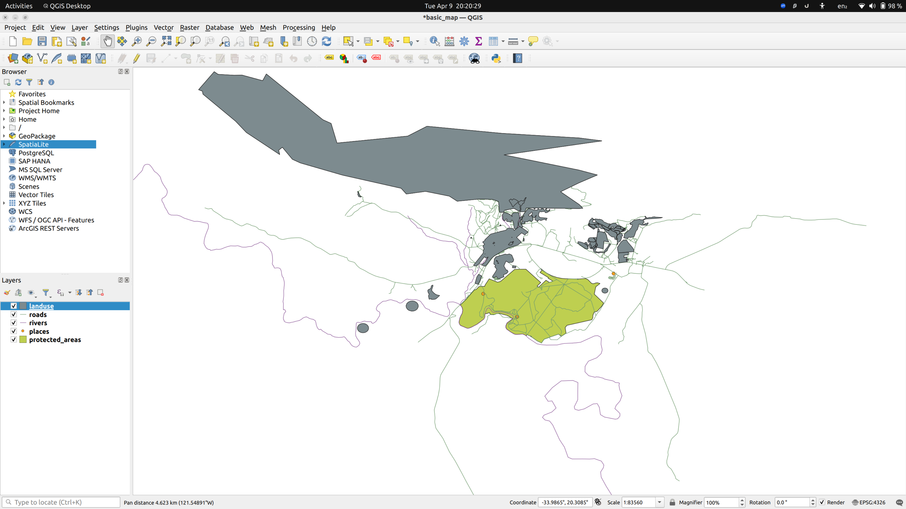

# qgis handson

The following sequence of actions were taken.

- Install QGIS on ubuntu 22.04
- Download training data from qgis training manual
- Create a new project in QGIS
- Load a basic shape file - protected areas
- Load river shape file. Observe layers tab showing all loaded shapes in a stack view
- Load Geopackage file - gpkg file format. Load roads from this dataset.
- Load sqlite data source - and load landuse data to layers.
- Save the project inside solutions directory.

This is how the layers look like when loaded properly:

