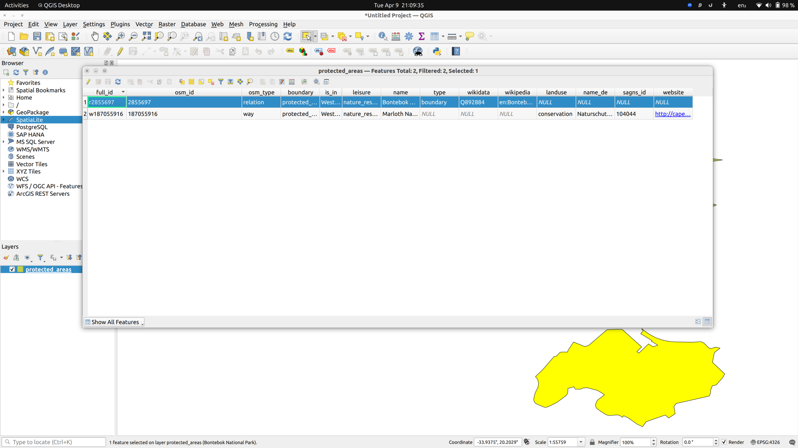

# qgis handson

### Loading data from data source manager

Different type of data sources used: Vector Shape files, GeoPacakge files and Spatiallite db file loaded from training dataset.

- Install QGIS on ubuntu 22.04
- Download training data from qgis training manual
- Create a new project in QGIS
- Load a basic shape file - protected areas
- Load river shape file. Observe layers tab showing all loaded shapes in a stack view
- Load Geopackage file - gpkg file format. Load roads from this dataset.
- Load sqlite data source - and load landuse data to layers.
- Save the project inside solutions directory.

This is how the layers look like when loaded properly:

#### Use of symbology

Symbology allows you change the visual representaiton of your layers. For example: changing the color fill, adding border etc.

The following image shows how you can do symbology on different layers to acheive something like this, where roads are marked bold, landuse base color is changed to green, buildings are marked red. Also buildings layer has scale dependent layer rendering. 

#### Vector data

>Vector data is arguably the most common kind of data in the daily use of GIS. The vector model represents the location and shape of geographic features using points, lines and polygons (and for 3D data also surfaces and volumes), while their other properties are included as attributes (often presented as a table in QGIS).

Attribute Table of a shape file has row colum structure. Rows are called "record" which is associated with a feature on the canvas map such as a Polygon.

Once you select a feature on the map, the corresponding record row will get highlighted

